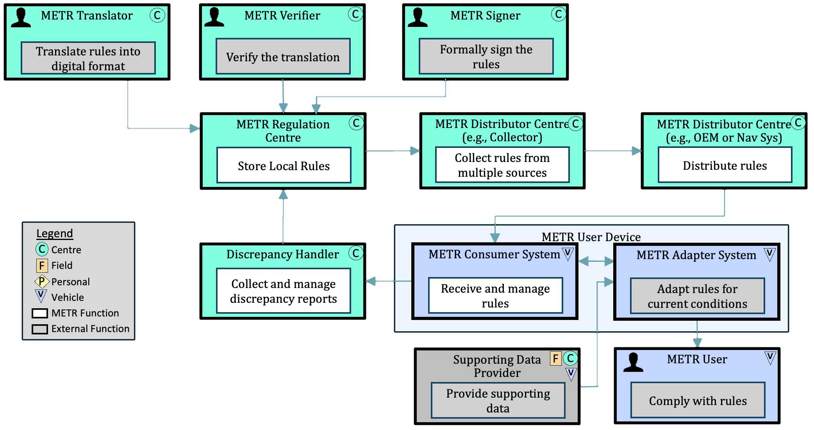

# Guide Structure

!!! note
    a. Audience: Planners and decision makers, end user representatives (fleet managers),

    b. Purpose: Understand the scope of METR systems and how they work together in various deployment configurations
    
    c. Scope Content: Deployment and usage scenarios (US-specific, European-specific deployment scenarios), regional framework, benefits to various stakeholders relevant legislation and encouragement
    
    d. Next Steps: Build scenarios
        1. Management of regulations within governmental agencies (e.g., UK TRO project)
        2. Provision of regulations to vehicles (e.g., ISA)
        3. Regulations for trip planning (e.g., which routes for Diesel vehicles)
        4. Provision of emergent regulations (e.g., work zones)
        5. As-built refinement of database (e.g., discrepancy management)

The METR implementation guides are being developed as a resource for the METR community to facilitate deployments and to allow users to share experiences.

Each implementation guide is presented from the perspective of one of the entities in the following diagram.

!!! note
    Need to update diagram to show all perspectives

- [Regional Guidance](regional-guidance.md) and [Sample Framework](regional-framework.md): Not shown on the diagram is the need for a regional framework that sets the rules for how to deploy METR within a region to ensure a base level of interoperability; the sample framework provides an initial cut at the topics that this document should address.
- [Rule Makers](rule-makers.md): The rule maker guide represents the METR translator, METR Verifier, and METR Signer as well as the rule-making functions that occur before translation occurs.
- [Regulation System](regulation-system.md): The regulation system guide provides information about setting up, operating, and maintaining a system to manage the collection and dissemination of regulations received from one or more METR Regulation Centers. The system repackages data, verifies cross-jurisdictional regulations, and disseminates the data. The distribution system contains a collector function, a distribution function, or both.
- [Distribution System](distribution-system.md): The distribution system guide provides information about setting up, operating, and maintaining a distribution system, which can contain a collector function, a distribution function, or both.
- [Consumer System](consumer-system.md): The consumer system guide provides information about setting up, operating, and maintaining a system to fulfil the data processing responsibilities assigned to the receiver and optionally the discrepancy reporter. The system facilitates end-use intake, vehicle-map integration, and automated traffic law ingestion. This does not however include the adapter system or METR user specifically, which are outside the scope of METR.
- [Discrepancy Handling System](discrepancy-handling-system.md): The discrepancy handling system guide provides information about setting up, operating, and maintaining a system that receives reports of discrepancies in regulations from METR User Systems. The system facilitates data conflict resolution, error analyses, and any discrepancy notification reporting back to regulators.
