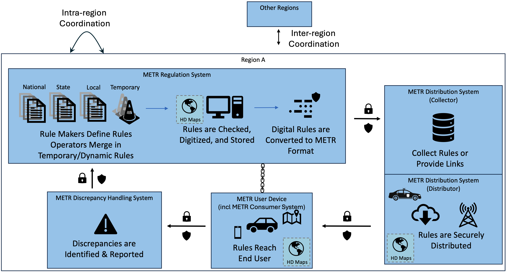

# Guide Structure

!!! note
    a. Audience: Planners and decision makers, end user representatives (fleet managers),

    b. Purpose: Understand the scope of METR systems and how they work together in various deployment configurations
    
    c. Scope Content: Deployment and usage scenarios (US-specific, European-specific deployment scenarios), regional framework, benefits to various stakeholders relevant legislation and encouragement
    
    d. Next Steps: Build scenarios
        1. Management of regulations within governmental agencies (e.g., UK TRO project)
        2. Provision of regulations to vehicles (e.g., ISA)
        3. Regulations for trip planning (e.g., which routes for Diesel vehicles)
        4. Provision of emergent regulations (e.g., work zones)
        5. As-built refinement of database (e.g., discrepancy management)

The METR implementation guides are being developed as a resource for the METR community to facilitate deployments, to allow users to share experiences, and to [allow systems to work together](../key-components.md).

Each implementation guide is presented from the perspective of one of the entities or connections in the following diagram.

- [Regional Guidance](../regional-body-perspective.md): The interfaces at the top of teh diagram indicate the need for a regional framework that sets the regulations for how to deploy METR within a region to ensure a base level of interoperability within that region while also setting policies for how METR user devices can transition between regions. This guide identifies key issues that need to be considered when defining a region.
- [Sample Framework](../regional-framework.md): The sample framework extends the discussion of the Regional Guidance by providing an initial stub of a page that identifies the topics that this page should address.
- [Rule Makers](../rule-maker-perspective.md): The rule maker guide represents the METR translator, METR Verifier, and METR Signer as well as the regulation-making functions that occur before translation occurs.
- [Regulation System](../regulation-system-perspective.md): The regulation system guide provides information about setting up, operating, and maintaining a system to manage the collection and dissemination of regulations received from one or more METR Regulation Centers. The system repackages data, verifies cross-jurisdictional regulations, and disseminates the data. The distribution system contains a collector function, a distribution function, or both.
- [Distribution System](../distribution-perspective.md): The distribution system guide provides information about setting up, operating, and maintaining a distribution system, which can contain a collector function, a distribution function, or both.
- [Consumer System](../consumer-perspective.md): Within the METR reference architecture, the consumer system is a part of the METR User Device that provides the regulations to the end user system and reporting identified discrepancies. This guide provides information about setting up, operating, and maintaining such a system. The consumer system provides regulations to adaptor systems (external to METR) that provide end-user functionality (e.g., navigation, vehicle control. etc).
- [Discrepancy Handling System](../discrepancy-handling-perspective.md): The discrepancy handling system guide provides information about setting up, operating, and maintaining a system that receives reports of discrepancies in regulations from METR User Systems. The system facilitates data conflict resolution, error analyses, and any discrepancy notification reporting back to regulators.
