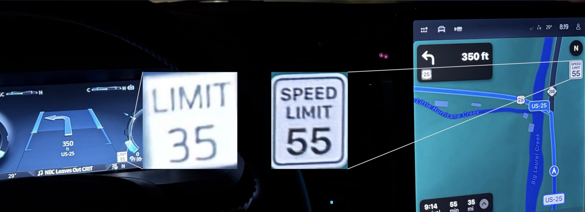
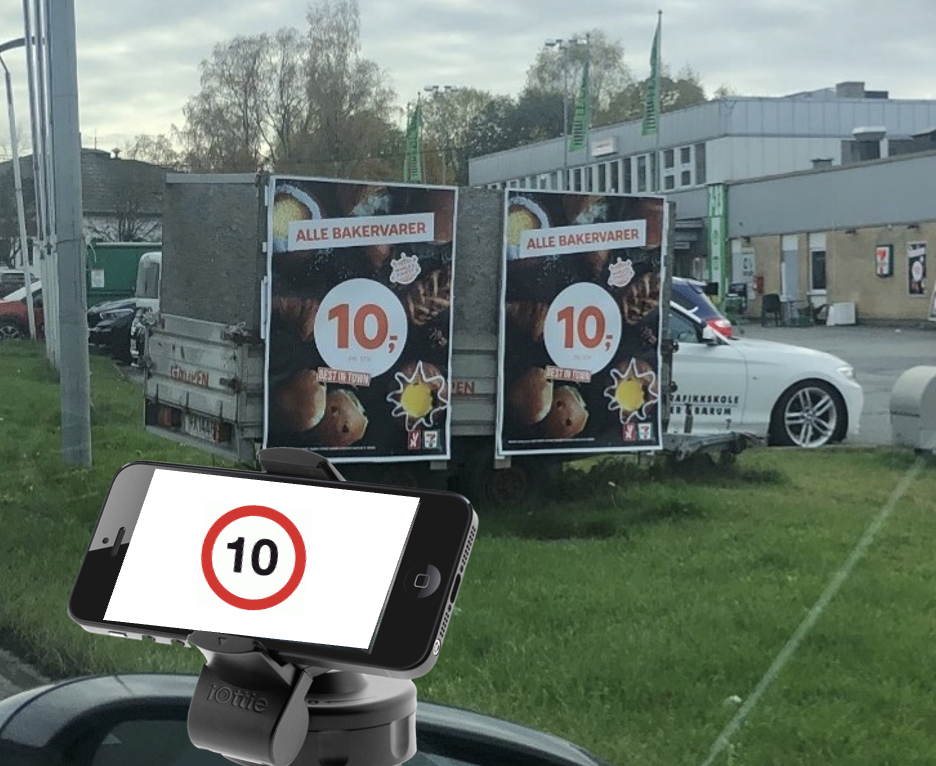

# Management of Electronic Transport Regulations (METR)

!!! note
    Audience: Non-technical, unfamiliar with METR

    Purpose: inform industry, encourage deployment

    Scope: “Is it needed?”, “Why should I care?”, “How does it fit into priorities?”

!!! abstract ""
    METR provides users with geo-specific, trustworthy, timely, authoritative, machine-interpretable, transport-related regulations (e.g., traffic regulations) established by jurisdictional entities

## The Challenge

The modern driving experience is rapidly evolving. The use of navigation systems is extremely wide spread and the adoption of Level 1-3 Automated Driving Systems (ADS) continues to expand. However, there are challenges in moving into Level 4 and 5 ADS. For the most part, current systems still rely upon a human driver in the loop due to challenges in always recognizing and following traffic regulations.

Most users are familiar with the problems. Systems built on databases face challenges in maintaining up-to-date information. As a result, most users of these systems have experienced their systems reporting an erroneous speed limit.

Video image processing systems also have challenges. Not only can signs be obscured, but signs can sometimes be misinterpreted.

## Impacts

These errors can lead to drivers violating the intended regulations; however, at present, the driver is still responsible for catching these inaccuracies and ensuring that the vehicle is operated in a safe and compliant manner. Migrating to Level 4 and Level 5 ADS requires a process that prevents these errors from happening. While there are some Level 4 Automated Driving Systems in operation, they have operational design domains (ODDs) that are limited to areas where the operating entities ensure that all regulations are properly understood. This type of solution can work for prototype and early deployments, but is not scalable for large-scale use. To achieve large scale deployments, the industry needs a way to provide traffic regulations to vehicles in a trustworthy, electronic manner.

If these errors persist, users will lose trust in driving systems and deployment of life-saving technologies will be delayed.

## The METR Solution

    <iframe
        width="560"
        height="315"
        src="https://www.youtube.com/embed/kqrGo-4EMe4?si=P_dMfUkAk8rlYHUM"
        title="YouTube video player"
        frameborder="0"
        allow="accelerometer; autoplay; clipboard-write; encrypted-media; gyroscope; picture-in-picture; web-share"
        referrerpolicy="strict-origin-when-cross-origin"
        allowfullscreen>
    </iframe>

[METR Vision](METRVision.pdf "A 13-page PDF describing METR"){ .md-button .md-button--primary target="_blank" }
[Vocabulary](documentation/Vocab.md "Definitions for key terms used in METR"){ .md-button .md-button--primary }
[Overview Presentation](METROverview.pdf "A 36-slide presentation describing METR"){ .md-button .md-button--primary target="_blank" }
[Discussion forum](https://github.com/ISO-TC204/iso24315/discussions){ .md-button .md-button--primary target="_blank" }

METR defines a complete, end-to-end from rule-maker to user approach to managing and distributing traffic regulations. METR's holistic approach enables the secure electronic dissemination of trustworthy traffic regulations, ensuring that all stakeholders and their support systems have access to current traffic regulations. The system can be used to disseminate all [types of traffic regulations](what-is-metr.md), including regulatory, advisory, and guidance information, including rules of the road. The technology will assist in both improving the quality of information provided to human drivers as well as enabling better trust of Automated Driving Systems.

Enabling the trustworthy transfer of electronic traffic regulations results in a complex system that is composed of separately purchased and managed systems (i.e., a system of systems). The reference architecture for this is defined in ISO 24315-3 and summarized below.

## Purpose of this Website

This website is intended to provide an overview of the METR standards, as defined in the ISO 24315 series, and to provide guidance on the development, deployment and operation of these systems. The normative METR requirements that are internationally applicable are are defined in the ISO 24315 series. However, these standards need to be supplemented by regional (e.g., European, North American, etc.) standards that refine the reference architecture into preferred deployment scenarios and protocols to be used for interoperability. This site provides links to these regional customizations of the international standards.
