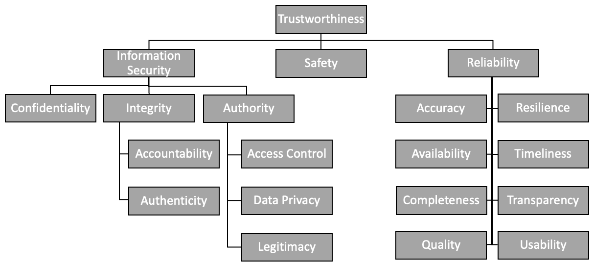

# Need for Trustworthiness

## Need for Trustworthiness

Trustworthiness is fundamental to METR working across each tier and system inherent in METR’s design. METR is intended to provide machine-interpretable rules that vehicles, travelers, transportation operators, and navigation service providers can rely on to distribute authentic, accurate, and timely information. For this to work, a user must be able to determine that a rule is legitimate, has been represented correctly, remains current, and applies to the relevant location, time, and road user or vehicle. Trustworthiness is a multi-dimensional construct (see figure below) that requires several factors to be trustworthy simultaneously. What’s more, this trustworthiness extends across the complete METR lifecycle—from the creation and encoding of a regulation, through verification and distribution, to its receipt, interpretation, use, and subsequent updates or corrections.

The term **trustworthy** encompasses a set of attributes that are often separately analysed and grouped in different ways. As shown in the figure below, METR groups the trustworthiness attributes under `information security`, `safety`, and `reliability`.

## Information Security

Information security deals with those characteristics related to ensuring that the information is secure and protected from unauthorized access, modification, or disclosure. The implementation approach should address relevant cybersecurity controls, including **authentication, authorization and access control, integrity protection, confidentiality where required, secure communications, cryptographic signing and verification, protection against unauthorized modification, secure storage, monitoring, vulnerability and patch management, and auditing/non-repudiation**. These controls protect the regulation and the systems that handle it from unauthorized access or alteration. As well, such controls provide evidence that the information received by a consumer can be traced to a trusted source.

One of the challenges to achieving information security is the need for one or more **trust bridges** ==(insert link)== between the legal or regulatory authority and the electronic representation ultimately received by a METR consumer. It is expected that many traffic regulation orders signed by a legal authority will need to be repackaged (perhaps multiple times) prior to distribution to the end user to ensure that they are distributed in an efficient manner. Repackaging a signed container results in losing the cryptographic signature; the trust bridge is used to establish confidence that the electronic regulation provided on the downstream end of the trust bridge is an authentic and faithful representation of the upstream electronic regulation. Every trust bridge decreases the level of trust in the information while increasing cost and complexity, so these should be avoided to the extent possible, while still conveying the necessary level of trust. The local METR deployment architecture should define the roles, verification processes, credentials, signatures, audit information, and accountability needed to maintain trust across the complete distribution chain.

## Safety

Safety is a primary reason that trustworthy electronic regulations are required. Providing incorrect, incomplete, or obsolete electronic regulations can result in an unsafe vehicle or traveller response. METR must support the timely delivery of R&amp;Rs that the system claims to provide (e.g., emergent speed limits). Safety also requires handling the discrepancies between electronic regulations and physical signs or other sources, with defined processes for identifying, verifying, communicating, and resolving those discrepancies.

## Reliability

Reliability relates to those attributes measure how well a system can provide services in a consistent enough fashion so that users can depend on them. Reliability attributes include **accuracy, availability, completeness, data quality, resilience, timeliness/freshness, transparency, and usability**. Reliability is particularly important for emergent regulations, which may need to reach affected users by more than one distribution path and no later than the time the regulation takes effect.

 For METR, location referencing ==(add link)== is a critical part of usability. An electronic regulation cannot be reliably applied if its geographic applicability is ambiguous or incorrectly represented. METR requires consistent methods for translating feature-based descriptions&mdash;such as references to a particular intersection, lane, road segment, bus stop, or sign&mdash;into a format that any receiving system can reliably and accurately interpret and locate within its context. This generally requires a converting the feature into a set of geographic coordinates coupled with other data and combining that reference with geographic navigation satellite system(GNSS) data and/or geographic information system (GIS) data using spatial referencing techniques. Location references also need to convey the level of accuracy so that the receiving system can avoid using the data inappropriately (for example, a speed limit sign can be estimated within 10 m and still provide useful speed limit information, but that accuracy would not be useful for positioning a parking space).

## Summary

Together, information security, safety, and reliability establish the foundation for trustworthiness. Such trust gives users the essential confidence not merely that electronic regulations exist, but that the regulations are authentic, protected, accurate, applicable, current, and available when needed. However, METR's trustworthiness requires a broader system that abides by established policies, roles, verification processes, data-quality requirements, operational controls, implementation checks, and iterative improvements. These concepts must be followed throughout the entire METR chain.

## Related pages

- [What is METR](what-is-metr.md)
- [System of systems](system-of-systems.md)
- [Roadway environment](roadway-environment.md)
- [Key components](key-components.md)
