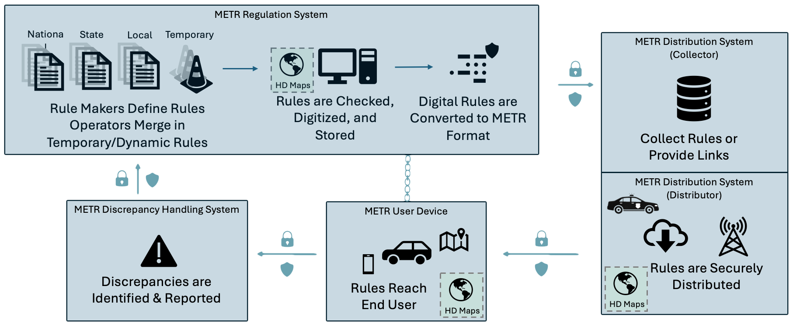

# METR overview

METR represents a groundbreaking approach to managing and distributing transportation rules. The system’s primary purpose is to enable electronic dissemination of trustworthy traffic regulations, ensuring that all stakeholders, and their support systems, have access to current regulatory information. The system can also be used to support the distribution of non-regulatory information (e.g., warnings, advisories) in a trustworthy manner.

Enabling the trustworthy transfer of electronic traffic regulations results in a complex system that is composed of separately purchased and managed systems (i.e., a system of systems). The reference architecture for this is defined in ISO 24315-3 and summarized below.

## Key components of the system of systems

The key components of the system are depicted in the following figure and explained further below.

The reference architecture of the METR system of systems consists of four major component systems that support external users and systems, as follows:

1. Regulation system: Regulators enter rules into a regulation system. The rules can include any transport rule, such as speed limits, advisory speeds, stop signs, warnings, parking restrictions, etc. While each regulator could have its own regulation system, it is envisioned that small regulators would enter their regulations into the regulation system of the local area. For example, a small store might need to register that it maintains a single regulation (e.g., a specific parking space in their parking lot is legally reserved for persons with disabilities). Rather than establishing their own regulation system to store this one regulation, the store owner can follow the procedures established by the local regulation system to enter their information into the METR network. The end result of this process is a digitally-signed transport rule from a trusted and verifiable source. The METR standards allow a regulation system to be shared by any number of regulators, but it is envisioned that most deployments will establish regulation systems at a reasonably local level and the digital signatures ideally should indicate the entity legally responsible for the rule. The regional METR implementation guide should provide additional clarity on how this is addressed within its target region accommodating the legal framework applicable for the region.

2. Distribution system: The METR reference architecture separates the distribution system from the regulation system to allow for different deployment scenarios. For example, while it is envisioned that there will be distinct regulation systems for each localized area (e.g., metropolitan area), it is envisioned that distribution systems are likely to cover much larger areas (e.g., national). This allows the METR consumer system to collect all rules for its journey even if it crosses the boundaries of localized regulation systems. Different distribution systems might also exist for different types of users to reflect that many rules apply to many or all users of a facility while some rules might be highly specialized. For example, heavy goods vehicles often have special regulations that are not posted and do not need to be distributed to all users. While these rules could be hosted by the same distribution system that hosts other rules, the METR standards allow for agencies to establish their distribution systems. It is the responsibility of the regional implementation guide to define how this works within the chosen region so that any user can have confidence that they are collecting all rules that they must follow.

3. The METR consumer system interacts with METR distribution systems to obtain the rules that it currently needs (i.e., for its current trip). Due to the constraints imposed by the communications and memory storage environment of the consumer system, the reference architecture focuses on providing the consumer system with the rules that are currently needed. While it is desirable to have perfect communications with the centralized distribution system; METR is designed to be resilient and assumes that communication failures and poor coverage will still occur. As such, when new rules emerge, the METR network needs to ensure multiple paths to inform METR users (e.g., notification from central and notification from a local beacon). The METR consumer system provides all known and current METR rules. Interpretation and presentation of these rules is left to external systems. For example, the METR consumer system is responsible for maintaining awareness of current parking restrictions; it is not responsible for comparing the applicable times for the parking restriction to the current time. That is left to the METR user system. For example, METR is responsible for informing the host system that parking restrictions are in affect from 08:00 to 12:00 local time. It is the responsibility of the METR user system and the METR user to realize that it is not wise to park in the space at 07:55, if the user plans to stay there for more than 5 minutes. By comparison an navigation system might use that same METR rule to assist a user to plan a trip for tomorrow. It is the navigation system's responsibility to be aware of the time that the user is planning for and to determine which rules will apply for that time.

4. The METR consumer system is also responsible for comparing all obtained rules and reporting any inconsistencies discovered. This includes inconsistencies detected (or suspected) between two electronic rules, inconsistencies between an electronic rule and a physical rule (e.g., a speed limit sign that disagrees with the electronic speed limit), or even two physical rules (e.g., a speed limit sign showing a one speed limit followed by another speed limit sign with a different speed limit within 50 meters for no apparent reason). The discrepancy handling system is responsible for collecting these reports from METR consumer systems. This type of discrepancy reporting is similar to crowd-sourced data. Any one report can easily be incorrect (e.g., a METR consumer system might report a missing speed limit sign when it was actually obstructed by another vehicle) but the trends in the reports can often provide useful insights. The discrepancy handling system is intended to perform the automated processing of the reports and alert the appropriate regulation systems when likely issues are identified. The criteria for determining when alerts should be issued need to be defined in the regional implementation guide. Further, how a METR consumer system determines where to send its discrepancy report also needs to be defined in the regional implementation guide.

The METR standards provide a framework for providing electronic rules, but as an international standard, these rules are designed to be very flexible to accommodate the political, legal, and financial realities across the world. It is the responsibility of regional framework and implementation guides to further guide deployments to develop a consistent environment within each region.

!!! note
    Scope: Deployment and usage scenarios, regional framework, benefits to various stakeholders, relevant legislation and encouragement

Traffic regulations are defined by multiple layers of government and different departments within each layer. For example, regulations can be defined by a regional (multi-national) government, national government, state or provincial government, county government, city government, and even more local entities (e.g., borough, subdivision, or property/campus owner). Further, each of these entities can authorize multiple representatives to issue regulations, often with specific scopes. The following a some typical examples of how authories can be divided within each level:

- the legislative arm can retain the authority to define any regulation it wishes
- traffic engineers define permanent traffic regulations (e.g., stop signs, speed limits)
- road operators (e.g., traffic management systems) implement specific types of regulations based on schedules and current conditions (e.g., dynamic speed limits, lane closures)
- maintenance personnel approve and implement temporary regulations in relation to road works
- law enforcement personnel implement specific types of regulations based on current conditions (e.g., road closures due to flooding)

Each of these entities potentially have their own distinct data entry system yet all of these regulations need to be digitized, and stored in a secure manner and made available for sharing with other systems in a standard format.

The end result is that a single trip can easily require being aware of regulations from dozens or hundreds of largely independent agencies. To simplify the process of obtaining all of these regulations, the reference architecture includes a collection service that is responsible for collecting all regulations from all relevant entities into a single data store. As a part of this process, the collector checks the composite set of regulations for any inconsistencies and reports any apparent discrepancies back to the source(s) for resolution.

Once the rules are collected, they need to be distributed to the end users. This can be done by the same collection system or by a separate system (within the reference architecture, both of these tasks are performed by the "distribution system"). Distributing the rules is its own complex task as the rules needed by one user can be different than the rules needed by a different user (e.g., due to the user's location, itinerary, vehicle type, etc.). The distribution system is responsible for repackaging the rules as necessary to ensure that each user is able to obtain the regulations that it needs in a timely, efficient, and trustworthy manner.

The METR consumer system on end user device is responsible for obtaining all of the rules from the distribution system, checking for any inconsistencies, and reporting any discrepancies. The METR consumer system is only responsible for receiving the complete trustworthy set of rules; it passes these rules to the end user system, which is responsible for determining how to apply the rules - this end user system is external to the defined METR system of systems. For example, METR provides the user system with the rules for both a daytime and night-time speed limit. It is the responsibility of the end user system to determine how this information should be used. One system might display both values to the driver while an automated driving system might compare the current time to the time of dusk and apply the appropriate speed limit directly. The details of how the information is used is outside the scope of the METR standards.

If a user device detects a discrepancy (e.g., between two electronic rules or between an electronic rule and a traffic control device), it should report it to a discrepancy handling system so that it can be properly investigated. While the reports submitted to a discrepancy handling system should be properly authenticated (e.g., using IEEE 1609.2), the data should still be treated as unconfirmed crowd-sourced information. For example, if only one report is received on a reasonably heavily travelled road, it is likely the result of some error (e.g., perhaps a road sign was temporarily obstructed); if multiple reports are received, but always from one make and model of user device, perhaps it is an issue with the code within that user device; if reports are received from the majority of user devices on the road, it is likely a legitimate issue to investigate. Issues to investigate are reported to the traffic regulation system responsible for the associated regulation and investigated according to their internal policies.
