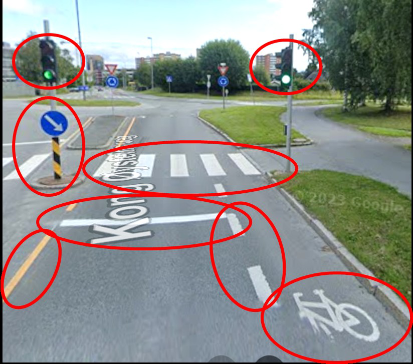

# TRO Installation and Implementation

After approval, most TROs are installed and implemented. In TRO language these words are distinct:

- **Installed** — physical measures described in the TRO are put in place (signs erected, markings applied, barriers set, signals configured).
- **Implemented** — those measures are *enabled* (covers removed, blank VMS messages posted, devices switched on) so the regulation can become active for observers.

A **traffic control device (TCD)** is physical infrastructure used to visually, audibly, or tangibly convey information to travellers — signs, signals, markings, barriers, and similar devices.

## Roles

| Role | Responsibility |
| --- | --- |
| **Regulation installer** | Posts regulations using conventional TCDs |
| **Regulation implementer** | Enables a regulation (makes the posting effective) |

Some TROs prepared for emergency preparedness may never be installed or implemented, depending on the jurisdiction. Others — for example city-wide parking packages — may be installed and implemented in sequence street by street.

## Two parallel flows

Implementation has a **physical infrastructure** path and a **METR digital infrastructure** path. They must stay coordinated:

**Physical path (simplified)**

1. Install required TRO measures.
2. Update legal and electronic TRO records to reflect as-built installation (including measured coordinates).
3. Activate / implement regulation(s) for observers.
4. Override or deactivate later as the order requires.

**Digital path (simplified)**

1. Receive updates from installation.
2. Translate the electronic TRO into METR information.
3. Distribute METR information.
4. Activate, override, or deactivate METR information in step with the roadway.

## Field adjustments and coordinates

Installers may adjust placement for sight lines or add devices so non-METR users can understand the layout. When that happens, accurate coordinates of TCDs — stop lines, signals, crossings, signs, barriers — should be measured and fed back so the approved TRO and electronic records stay true to the as-built roadway.

Wrong stop-line or marking coordinates can have serious consequences for ITS and automated driving applications.

## Who uses which representation

- **Non-METR users** rely on observing the physical TCDs.
- **METR users** rely on distributed METR information that encodes the approved TRO, optionally supplemented by vehicle sensors that recognize signs and markings.

Both communities should experience the same regulatory intent at the same time — which is the subject of [physical and digital activation](tro-physical-digital-activation.md).
