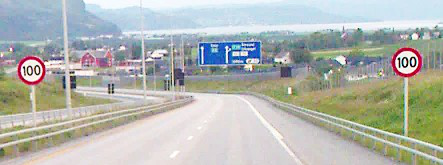

# Regulation and TRO Representations

The same regulation (and the same TRO) can exist in several representations. Rule makers must keep them equivalent — especially legal and electronic forms — because both can underpin enforcement and automated compliance.

## Regulation representations

| Representation | What it is | Why it matters |
| --- | --- | --- |
| **Legal regulation** | Regulation as recorded in official jurisdictional records | Human-readable master of record |
| **Electronic regulation** | Structured digital form a computer can process to determine intent | Bridge from legal drafting to systems |
| **METR regulation** | Electronic regulation produced and distributed in a trustworthy METR manner | What METR users actually receive |
| **Physical regulation** | Regulation as presented in the field (signs, markings, signals, barriers) | What non-METR users observe; as-built truth on the road |

Because legal and electronic representations can both support enforcement, they must be verified as equivalent. That is a primary reason jurisdictions are encouraged to adopt electronic formats early in the regulation-making process rather than treating digitization as an afterthought.

## TRO representations

| Representation | What it is | Why it matters |
| --- | --- | --- |
| **Legal TRO** | Official human-readable order (text, plans, maps, drawings, pictures) | Master package for the set of regulations |
| **Electronic TRO** | Structured digital representation of the TRO and its regulations | Machine-processable form of the order |
| **METR TRO** | Electronic TRO conforming to METR requirements | Trustworthy, interoperable package for distribution |

An electronic TRO may begin as a set of files in mixed formats. Translation into secured METR formats is what delivers security and interoperability to METR users.

## Physical presence

Physical representation is not “another document”; it is the roadway manifestation of posted regulations. Wrong coordinates for a stop line or missing devices create hybrid discrepancies between METR data and what travellers see.

## Rule-maker practice

1. Draft so that location, conditions, and exemptions can be encoded without ambiguity.
2. Maintain traceability from each METR regulation back to the legal TRO clause or annex.
3. Record verification that electronic intent matches the legal master before signing for distribution.
4. After installation, update coordinates and as-built details in both legal and electronic records when field adjustments are necessary.

Next: [proposal and approval](tro-proposal-and-approval.md).
